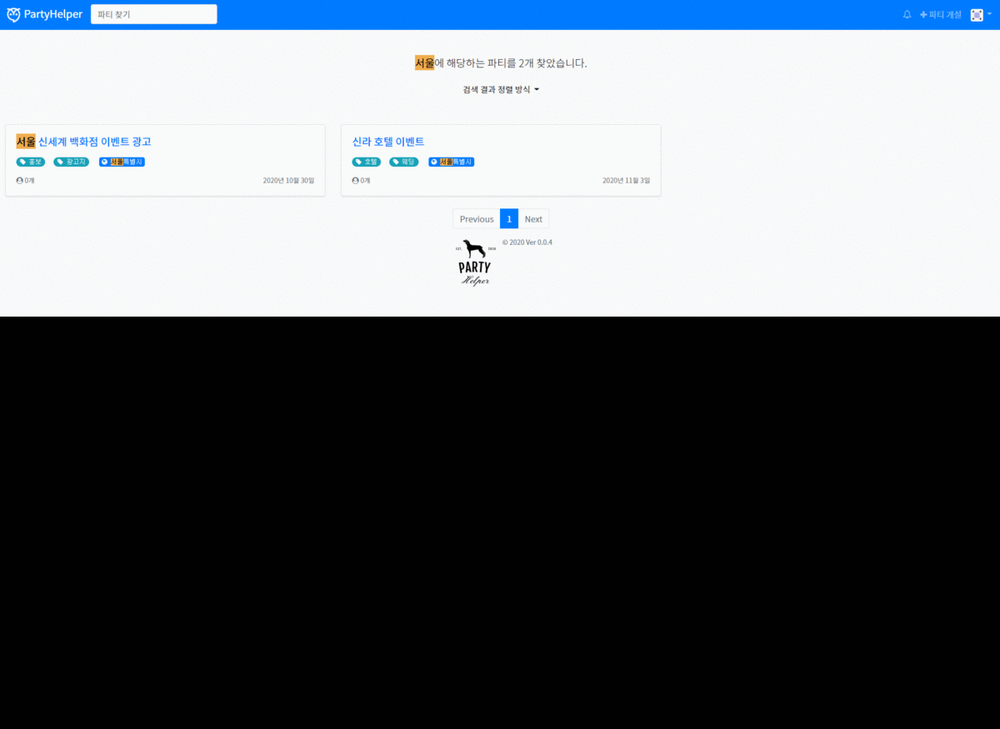

# spring-partyhelper 

고객과 이벤트 업체를 연결해주는 웹 애플리케이션
(http://www.partyhelper.ml)

## 개발환경

프로젝트 개발 환경은 다음과 같습니다.

* IDE : IntelliJ IDEA Ultimate
* Git Tools : Source Tree
* OS : Windows10
* SpringBoot 2.2.9
* Java11
* Maven
* 기타

</img>

## 기능

- 폼 로그인, Oauth2 로그인(Google, Naver), 회원가입, 이메일 인증(토큰 확인)
- 프로필 수정, 태그, 위치
- 파티 CRUD, 관리자 확인, 선착순 기능
- 검색
- 알림 (웹, 이메일)

## 구조

</img> 

</img> 
